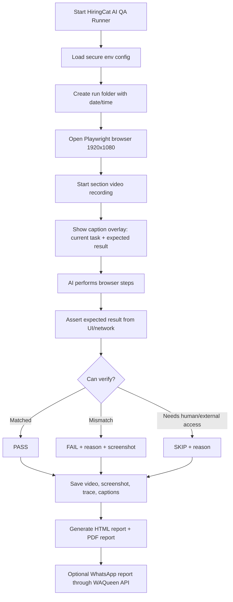

# HiringCat QA Checklist

Static GitHub Pages QA checklist for HiringCat.

## Files

- `index.html` - complete QA page with sections, checkboxes, Pass/Fail/Skip, notes, localStorage progress, copy report, and PDF download.
- `scripts/ai-qa-runner.mjs` - Playwright-based AI QA runner that records HD evidence, adds visible captions, generates report HTML/PDF, and can send the report through WAQueen.
- `.env.example` - safe config template. Never commit real passwords or API keys.

## AI QA Runner Workflow



The runner is deliberately strict: it only marks `PASS` when it can verify the expected result through browser/UI assertions. If credentials, OTP, Gmail, DNS, payment, or send-ready WhatsApp access is missing, it marks the section `SKIP` with a human-required reason.

## Run Locally

```bash
cd /root/abdullah/hiringcat-qa
cp .env.example .env
npm install
npm test
npm run qa:ai
```

Fast smoke run:

```bash
npm run qa:ai:smoke
```

Run output is written to:

```text
runs/<timestamp>/
  report.html
  HiringCat-AI-QA-<timestamp>.pdf
  summary.json
  videos/*.webm
  screenshots/*.png
  traces/*.zip
  captions/*.vtt
```

## WhatsApp Delivery

The runner can send the final report link/PDF through WAQueen:

```text
SEND_WHATSAPP=1
QA_REPORT_PHONE=+923294049067
WAQUEEN_API_KEY=<private key with messages:send scope>
```

WAQueen endpoint used:

```text
POST https://waqueen.com/api/v1/messages
Authorization: Bearer $WAQUEEN_API_KEY
```

Keep `SEND_WHATSAPP=0` until the run files are pushed or hosted somewhere public. Otherwise the WhatsApp message may contain links that are not live yet.

## Video Upload Options

- `VIDEO_UPLOAD_PROVIDER=local`: videos are stored in the repo under `runs/<timestamp>/` and become public after commit/push to GitHub Pages.
- `VIDEO_UPLOAD_PROVIDER=moonpush`: videos upload to MoonPush API. Use only when temporary links are acceptable.
- For permanent evidence at scale, use Cloudflare R2/S3 and extend `uploadArtifacts()` with the bucket uploader.

## Deploy To GitHub Pages

```bash
cd /root/abdullah/hiringcat-qa
git init
git add index.html README.md
git commit -m "Create HiringCat QA checklist"
gh repo create hiringcat-qa --public --source=. --remote=origin --push
gh api -X POST repos/aamirmursleen/hiringcat-qa/pages -f source.branch=main -f source.path=/
```

Final URL:

```text
https://aamirmursleen.github.io/hiringcat-qa/
```

If GitHub Pages already exists, push updates to `main`; the same URL will update automatically.

## QA Rules

- Do not put passwords, API keys, SMTP passwords, license keys, or private tokens on the public page.
- Share test credentials privately.
- Mark `Fail` only when actual result does not match expected result.
- Mark `Skip` when feature is unavailable or test data is missing.
- Every `Fail` needs a screenshot/video link in notes.
- Rotate any API key that was pasted into chat or public tooling.
